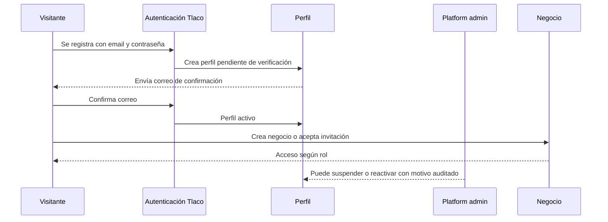
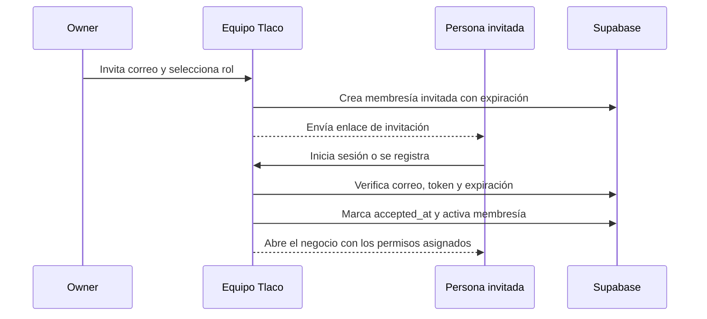
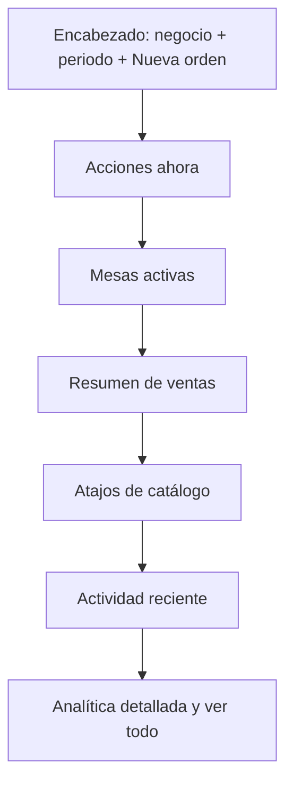
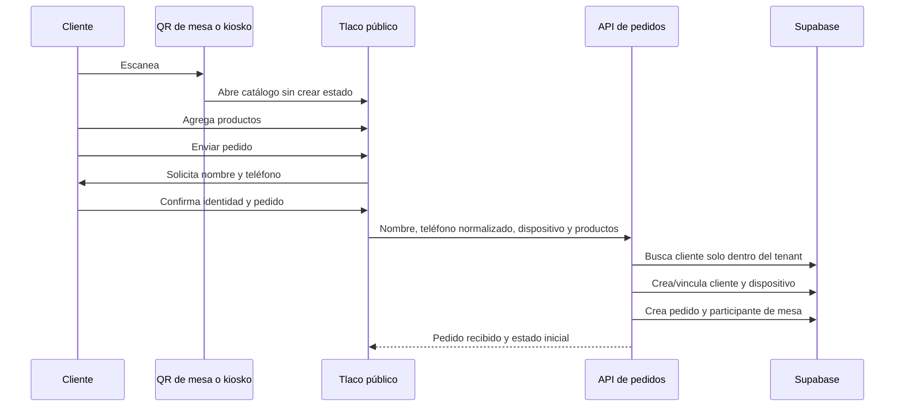
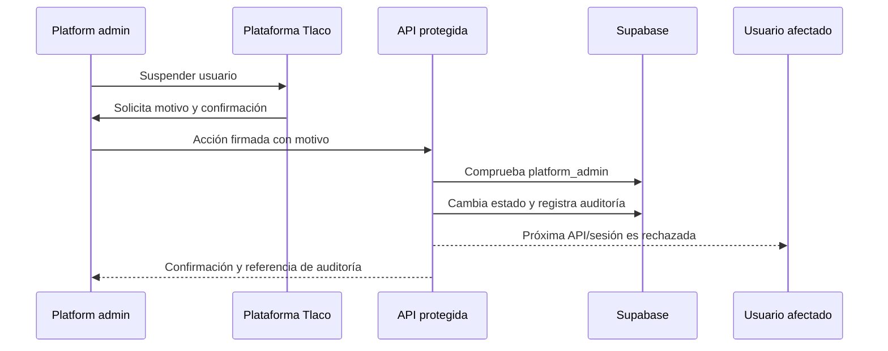

# Plataforma Tlaco: clientes y operación de producción

## Propósito y alcance

Este documento define cómo opera Tlaco como plataforma: altas de usuarios y
negocios, identidad de compradores, supervisión administrativa y salida a
producción. El esquema comercial de membresías, planes y cobros recurrentes
queda fuera de este alcance.

Principios:

- Un escaneo de QR es pasivo: no crea cliente, pedido ni ocupa una mesa.
- La identidad se crea al realizar una acción con valor: enviar el primer
  pedido.
- Los datos de un cliente siempre pertenecen al negocio donde fueron
  registrados; nunca se comparten entre negocios por coincidencia de teléfono.
- Una persona de Plataforma puede observar y moderar; no debe alterar ventas,
  pagos o préstamos sin una acción auditada y explícita.
- Mercado Pago y Supabase son la fuente de verdad de pagos y datos;
  el navegador solo refleja su estado.

## Roles

| Rol | Alcance | Acciones principales |
|---|---|---|
| Visitante QR | Solo el contexto del QR | Ve catálogo y arma pedido sin identidad persistente. |
| Cliente | Un negocio y su dispositivo vinculado | Compra, consulta su pedido, paga y ve historial propio cuando aplique. |
| Responsable de mesa | Cliente identificado con al menos un pedido enviado | Revisa pagos de la mesa y puede pagar una cuenta pendiente de forma explícita. |
| Equipo del negocio | Un negocio según permisos | Atiende pedidos, mesas, clientes y préstamos. |
| Owner | Un negocio | Gestiona equipo, configuración y recursos del negocio. |
| `platform_admin` | Toda la plataforma | Revisa usuarios, negocios, actividad, incidencias y suspensiones. |

## Ciclo de vida de usuario y negocio



### Reglas operativas

1. Un registro sin correo confirmado no puede iniciar operación sensible.
2. El alta de un negocio crea su owner y sus roles base en la misma
   transacción lógica.
3. Un usuario suspendido pierde sesión efectiva: dashboard y APIs deben
   rechazarlo aunque conserve una cookie previa.
4. Una suspensión no borra datos ni negocio; conserva trazabilidad y puede
   revertirse.
5. Las invitaciones se aceptan por usuario autenticado y se registran con
   `accepted_at`.

## Equipo de cada negocio

Cada negocio puede tener usuarios ilimitados. No se cobra ni se limita al
negocio por la cantidad de personas de su equipo; la capacidad se organiza con
roles y permisos, no con un contador comercial.

### Estados de una invitación o membresía

| Estado | Qué significa | Qué puede hacer la persona |
|---|---|---|
| Invitada | El owner envió una invitación; aún no se acepta. | Solo abrir el enlace e iniciar/crear sesión. |
| Activa | Aceptó la invitación y tiene un rol. | Usar únicamente los permisos del rol. |
| Suspendida | Se detuvo su acceso al negocio, sin borrar historial. | No puede entrar a ese negocio ni usar sus APIs. |
| Eliminada | La relación con el negocio terminó. | Pierde acceso; los pedidos y acciones previas conservan actor histórico. |

### Roles y reglas

| Rol | Capacidad |
|---|---|
| Owner | Único responsable de configuración crítica, equipo, datos del negocio y transferir propiedad. |
| Miembro | Rol base para atender, tomar pedidos o consultar módulos según permisos asignados. |
| Rol personalizado | El owner puede otorgar solo los permisos requeridos: órdenes, mesas, clientes, préstamos, catálogo o reportes. |

- Un negocio debe conservar al menos un owner activo.
- El owner no puede eliminarse a sí mismo sin transferir propiedad primero.
- Cambiar rol, suspender, reactivar, invitar o eliminar registra actor, motivo,
  usuario afectado y fecha en auditoría.
- Una invitación no aceptada expira; reenviarla invalida el enlace anterior.
- Las acciones creadas por alguien que después se elimina conservan su autor
  histórico; no se reasignan silenciosamente.

### Flujo de invitación



## Dashboard del negocio: experiencia de operación

El dashboard no debe iniciar con información comercial o de configuración. En
móvil, quien lo abre normalmente quiere saber qué atender ahora: pedidos sin
asignar, mesas activas y cobros pendientes. La interfaz debe usar esa jerarquía
y dejar ventas, catálogo y analítica como contexto progresivo.

### Estructura propuesta



| Prioridad | Bloque | Propósito y comportamiento |
|---|---|---|
| 1 | Encabezado compacto | Nombre del negocio, selector de periodo y CTA `Nueva orden`. En móvil el CTA ocupa todo el ancho disponible y el periodo permanece compacto. |
| 2 | Acciones ahora | Una sola franja con pedidos en proceso y sin asignar. Si no hay pendientes, se oculta en lugar de reservar espacio vacío. Tocar abre el filtro correspondiente. |
| 3 | Mesas activas | Primer listado operativo: nombre, total, estado y enlace `Ver todas`. Una mesa se abre al tocar toda la tarjeta, no solo texto pequeño. |
| 4 | Ventas del periodo | Cuatro métricas legibles: vendido, cobrado, activas y completadas. Cada métrica explica su relación y enlaza al detalle. |
| 5 | Catálogo | Dos atajos pequeños para Productos y Servicios con sus conteos; no compiten visualmente con el trabajo pendiente. |
| 6 | Seguimiento | Aviso de órdenes sin asignar y ranking por usuario solo cuando aportan una decisión. |
| 7 | Analítica | Lo más vendido y actividad reciente bajo `Ver detalle`; en móvil se muestran como previews de máximo tres filas. |

### Reglas de UX mobile-first

- La pantalla abre con `Nueva orden`, acciones pendientes y mesas visibles sin
  tener que recorrer una tarjeta de plan o un bloque decorativo.
- Las tarjetas de acción tienen área táctil mínima de 44 px y una sola acción
  principal. No se duplican flechas, links y botones para el mismo destino.
- La información secundaria se resume: tres productos/servicios y tres eventos
  recientes; `Ver todo` lleva al módulo con el filtro ya aplicado.
- Los estados usan texto más color: `En proceso`, `Sin asignar`, `Cobrado`;
  nunca solo un punto o color.
- Las cifras monetarias usan ancho tabular y la fecha/periodo queda cerca de la
  métrica que modifica.
- El menú inferior se mantiene visible; el contenido termina con espacio seguro
  para no quedar detrás de él.
- En escritorio se conservan los mismos bloques, pero Ventas y Catálogo pueden
  usar cuadrícula. No se crean flujos distintos entre móvil y escritorio.

### Estados que sustituyen la tarjeta de plan

La tarjeta de plan no ocupa la parte superior del Inicio. La configuración del
negocio y cualquier información administrativa se consultan desde
`Configuración` o el selector de negocio. En Inicio solo aparecen avisos que
requieran una decisión operativa real, por ejemplo: error de cobro de una orden,
mesa bloqueada o pedido sin asignar.

## Métricas de equipo en el dashboard

El owner ve un resumen pequeño, nunca invasivo, dentro de Seguimiento:

- `4 personas activas hoy`;
- `4 órdenes sin asignar` cuando aplique;
- ventas y órdenes por persona del periodo;
- acceso directo a `Equipo` para invitar, ajustar rol o suspender.

Un miembro solo ve su propia carga y los indicadores permitidos por su rol. No
ve correos, permisos ni actividad privada de otras personas.

## Identidad de clientes y mesas

### Flujo de primer pedido



### Reglas de identidad

- El teléfono se normaliza a E.164 antes de comparar y se guarda el valor
  original únicamente si es necesario para presentación.
- El dispositivo se persiste como hash, nunca como identificador crudo.
- Si un dispositivo vuelve al mismo negocio, se presenta una confirmación:
  `¿Eres Saul? · *** 1420`.
- Confirmar vincula el dispositivo al cliente existente; rechazar inicia una
  nueva identidad local al negocio.
- Escribir el mismo teléfono desde un dispositivo distinto no recupera historial
  automáticamente. La recuperación entre dispositivos será una fase posterior
  mediante verificación por correo.
- Un cliente solo puede convertirse en responsable después de identificarse y
  enviar al menos un producto. Escanear primero no lo convierte en responsable.
- La mesa se considera ocupada cuando existe un pedido activo, no al escanear.

### Responsable de mesa

El primer cliente elegible ve un mensaje opcional, no bloqueante:

> “¿Llevarás la cuenta de esta mesa? Podrás revisar los pagos pendientes, sin
> afectar lo que paga cada persona.”

Puede elegirse después si nadie lo hizo. El responsable puede:

- ver participantes, estados y montos pendientes;
- actualizar la vista de pagos;
- iniciar el pago de otra cuenta solo tras elegirla y confirmar el monto;
- nunca asumir pagos, identidad ni productos de otro cliente.

## Modelo de datos requerido

| Recurso | Cambio | Motivo |
|---|---|---|
| `customers` | `normalized_phone`, `identity_consent_at`, `last_seen_at` | Búsqueda segura y consentimiento. |
| `customer_devices` | `tenant_id`, `customer_id`, `device_hash`, `last_seen_at`, `revoked_at` | Vínculo local de dispositivo. |
| `orders` | Mantener `customer_id` para kiosko y pedido individual | Historial y crédito del cliente. |
| Participantes de mesa | `customer_id`, `is_owner`, timestamps | Fuente de verdad por persona en cuentas divididas. |
| `order_devices` | `customer_id` opcional | Relación de origen sin exponer identificador crudo. |
| `payments` | `customer_id` opcional | Auditoría del pagador cuando aplique. |
| `platform_activity_events` | actor, tenant, acción, entidad, payload mínimo, fecha | Auditoría transversal. |
| Perfil/estado de acceso | `active`, `suspended_at`, `suspended_by`, `suspension_reason` | Moderación reversible. |

Índices mínimos:

```sql
create unique index customers_tenant_normalized_phone_unique
  on public.customers (tenant_id, normalized_phone)
  where normalized_phone is not null;

create unique index customer_devices_tenant_hash_unique
  on public.customer_devices (tenant_id, device_hash)
  where revoked_at is null;

create index platform_activity_events_tenant_created_idx
  on public.platform_activity_events (tenant_id, created_at desc);
```

## Plataforma Tlaco

`/dashboard/plataforma` se mantiene exclusivamente para `platform_admin`.
Debe organizarse en cuatro vistas, con filtros por fecha, negocio y estado.

| Vista | Muestra | Acciones permitidas |
|---|---|---|
| Usuarios | Perfil, correo, verificación, estado, últimos accesos, negocios | Aprobar, suspender, reactivar y reenviar verificación. |
| Negocios | Owner, usuarios activos/invitados, estado operativo, mesas activas, kioskos, ventas y última actividad | Abrir detalle, suspender acceso ante incidente y registrar nota. |
| Operación | Pedidos, pagos, fallos de webhook, préstamos y recursos con error | Investigar y abrir detalle; no editar importes directamente. |
| Auditoría | Altas, cambios de roles, suspensiones, pedidos, pagos y acciones admin | Filtrar, exportar y conservar evidencia. |

### Acciones administrativas seguras



No se permite borrar usuarios, negocios, pagos ni préstamos desde esta vista.
Corregir información financiera requiere un flujo específico y auditado.

## APIs propuestas

| Método | Ruta | Protección | Propósito |
|---|---|---|---|
| `GET` | `/api/platform/users` | `platform_admin` | Usuarios y estados. |
| `PATCH` | `/api/platform/users/:id/status` | `platform_admin` | Suspender/reactivar con motivo. |
| `POST` | `/api/platform/users/:id/resend-verification` | `platform_admin` | Reenviar correo sin revelar tokens. |
| `GET` | `/api/platform/tenants` | `platform_admin` | Negocios y estado operativo. |
| `GET` | `/api/platform/activity` | `platform_admin` | Auditoría transversal paginada. |
| `GET` | `/api/platform/operation-health` | `platform_admin` | Webhooks fallidos, colas y recursos con error. |
| `POST` | `/api/customers/identify` | Contexto QR válido | Crear/vincular identidad al enviar pedido. |
| `POST` | `/api/customers/confirm-device` | Contexto QR válido | Confirmar cliente conocido en ese dispositivo. |

Todas las rutas de Plataforma validan `isPlatformAdmin(user.id)` en el
servidor. La navegación del cliente solo mejora la UX; no autoriza.

## Operación de producción

### Webhooks y pagos

1. Mercado Pago llama al webhook con firma.
2. Tlaco valida la firma antes de leer o actualizar datos.
3. Se consulta a Mercado Pago con el id del evento; no se confía en el monto
   enviado por el navegador.
4. Se guarda el pago con una llave idempotente.
5. Un evento repetido no duplica pago, orden ni inventario.
6. Si falla una dependencia, la API responde `500` para que Mercado Pago
   reintente; los errores se monitorean.

### Observabilidad

Registrar y alertar sobre:

- webhook rechazado, fallido o reintentado;
- pedido que no cambia de estado tras pago confirmado;
- error de inventario o stock negativo;
- usuario suspendido intentando entrar;
- error de RLS, Storage o migración;
- mesa con pedido abierto durante un tiempo anómalo;
- volumen de consultas del QR y latencia de sus endpoints.

Cada alerta debe incluir tenant, entidad, id de correlación y fecha; nunca
teléfono completo, token QR ni datos de tarjeta.

### Controles de seguridad

- Variables de entorno solo en Vercel/Supabase, nunca en el cliente.
- `SUPABASE_SERVICE_ROLE_KEY` se usa únicamente en rutas servidor.
- RLS en todos los datos de negocio y service role solo en operaciones
  administrativas o webhooks.
- Rotar secretos si aparecen en logs o una conversación pública.
- Backups y prueba de restauración antes de cambios de esquema relevantes.
- Rate limit para QR, login, reenvío de correo e identificación de cliente.

## Salida a producción

### Prueba de membresías sin cargo real

Para comprobar límites y pantallas sin cobrar dinero, usa exclusivamente local
o staging con `BILLING_TEST_MODE=true`. La ruta
`POST /api/billing/test-activate` exige una sesión `platform_admin`, deja una
auditoría `billing.test_plan_activated` y otorga un plan por 30 días sin crear
una autorización ni un pago en Mercado Pago. En producción la ruta responde
`404`, aun si alguien conoce su URL.

Ejemplo autenticado para un negocio de prueba:

```json
POST /api/billing/test-activate
{ "tenant_id": "<uuid-del-negocio>", "plan_code": "operation" }
```

Esta prueba verifica entitlements (20 mesas, kiosko y recomendación), pero no
el ciclo real de Mercado Pago. Ese segundo caso debe probarse con credenciales
de sandbox, cuenta compradora y tarjeta de prueba de Mercado Pago; nunca con
el token productivo ni una tarjeta real.

### Antes de desplegar

- [ ] Aplicar migraciones en staging y después en producción.
- [ ] Regenerar tipos de Supabase.
- [ ] Verificar que `saul.franco1420@gmail.com` tenga fila real en
      `platform_admins`.
- [ ] Configurar URL pública `https://tlaco.vercel.app` en Auth, redirects y QR.
- [ ] Configurar webhook de Mercado Pago y validar su firma en sandbox.
- [ ] Configurar alertas de errores, logs y retención de auditoría.
- [ ] Probar usuario suspendido, reactivado y sin correo confirmado.

### Pruebas de aceptación

1. Escanear QR no crea mesa, cliente ni pedido.
2. Enviar primer pedido pide nombre y teléfono, crea un único cliente dentro de
   ese negocio y vincula el dispositivo hasheado.
3. El mismo dispositivo reconoce al cliente solo dentro del mismo negocio.
4. Una segunda persona puede pagar su parte sin reemplazar el estado del primer
   cliente.
5. El responsable de mesa solo aparece tras identidad y pedido enviado.
6. Un usuario suspendido no puede usar dashboard ni APIs autenticadas.
7. Un `platform_admin` ve auditoría; un owner normal recibe `403`.
8. Un webhook repetido no duplica pagos ni modifica stock dos veces.

### Despliegue y reversión

1. Desplegar primero migraciones compatibles y después aplicación.
2. Activar la experiencia nueva mediante feature flag por tenant piloto.
3. Observar pagos, pedidos, identificación y errores durante 24 horas.
4. Si existe incidente, desactivar el flag o revertir la aplicación; no borrar
   las nuevas columnas ni la auditoría.
5. Comunicar al negocio afectado el estado y la acción de recuperación.
