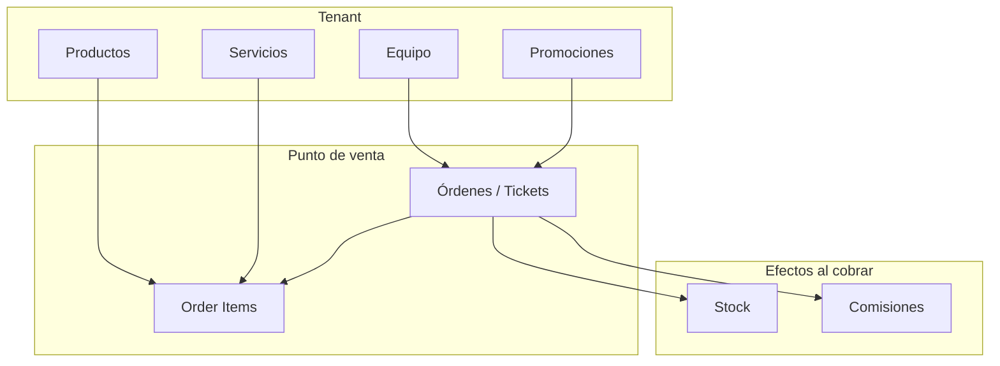

# Contexto Pars Commerce y Punto de Venta (POS)

Documento pensado para compartir con un modelo de producción. Explica el proyecto globalmente y cómo está organizado el punto de venta.

---

## 1. Qué es Pars Commerce

**Pars Commerce** es una plataforma **multi-tenant** para gestión de negocios que incluye:

- Catálogo de productos y servicios
- Órdenes y tickets (el punto de venta)
- Equipo por negocio (roles, miembros, invitaciones)
- Comisiones de venta
- Sitio público por negocio (`/sitio/[slug]`)

**Stack:** Next.js 15 (App Router), TypeScript, Tailwind, Supabase (Auth, Postgres, RLS, Storage), Zustand.

---

## 2. Modelo multi-tenant

- Cada negocio es un **tenant** con `tenant_id` (UUID).
- Los usuarios tienen **memberships** por tenant con roles (owner, manager, member).
- Permisos por rol: `products.write`, `team.write`, `settings.write`.
- El slug del tenant (`/dashboard/[tenantSlug]`) se usa en URLs del dashboard.

**Archivos clave:**

- Core: `[supabase/migrations/20260202000001_pars_commerce_core.sql](supabase/migrations/20260202000001_pars_commerce_core.sql)` (tenants, memberships, roles)
- Commerce: `[supabase/migrations/20260202000002_pars_commerce_commerce.sql](supabase/migrations/20260202000002_pars_commerce_commerce.sql)`

---

## 3. Punto de venta: Órdenes / Tickets

El “punto de venta” está en **Órdenes / Tickets**, no en una sección con nombre “POS”. La lógica es:

- **Orden** = ticket de venta.
- Una orden pasa por estados y termina en `paid` cuando la venta está cobrada.
- Puede contener productos y/o servicios.

### 3.1 Orígenes de las órdenes (source)

| source         | Origen    | Descripción                              |
| -------------- | --------- | ---------------------------------------- |
| `dashboard`    | Dashboard | Creadas desde el panel del negocio (POS) |
| `public_store` | Sitio web | Creadas desde el e-commerce público      |

Configuración en `[src/lib/formatSource.ts](src/lib/formatSource.ts)`.

### 3.2 Estados de la orden

```
draft → assigned → in_progress → completed → pending_payment → paid → completed
                                    ↘ pending_pickup ↗
                                    ↘ cancelled
```

- **draft**: Orden recién creada, se pueden agregar items.
- **assigned**: Asignada a un miembro del equipo.
- **in_progress**: En trabajo (ej. servicio en curso).
- **completed**: Trabajo terminado, pendiente de cobro.
- **pending_payment**: Link de pago generado (MercadoPago), esperando pago.
- **pending_pickup**: Compra online pagada, pendiente de recoger.
- **paid**: Cobrada.
- **cancelled**: Cancelada (puede restaurar stock si venía de paid).

Restricciones en DB: `[supabase/migrations/20260216000001_promotions_and_cart.sql](supabase/migrations/20260216000001_promotions_and_cart.sql)` (líneas 48–51).

---

## 4. Flujo del punto de venta en el Dashboard

### 4.1 Crear orden

1. Ir a **Órdenes** → **Nueva orden**.
2. Formulario con datos de cliente (opcional) y asignación (opcional).
3. Se crea orden en `draft` y se redirige al detalle.

**Archivo:** `[src/app/dashboard/[tenantSlug]/ordenes/nueva/page.tsx](src/app/dashboard/[tenantSlug]/ordenes/nueva/page.tsx)`

### 4.2 Detalle de orden (el núcleo del POS)

Página: `/dashboard/[tenantSlug]/ordenes/[orderId]`.

Componentes principales:

- **OrderHeader**: Estado, acciones.
- **OrderItemsTable**: Items, agregar/quitar (solo en draft/assigned), descuento, totales.
- **CustomerCard**: Datos de cliente.
- **AssignmentCard**: Asignación a miembro del equipo.
- **PaymentLinkCard**: Generar link MercadoPago.
- **ReceiptActions**: Descargar/imprimir ticket.
- **OrderActionButtons**: Cambios de estado y cobro.

**Archivo principal:** `[src/app/dashboard/[tenantSlug]/ordenes/[orderId]/page.tsx](src/app/dashboard/[tenantSlug]/ordenes/[orderId]/page.tsx)`

### 4.3 Agregar items

- Modal `AddItemModal` con búsqueda por subcatálogo o texto.
- Soporta productos (`type = 'product'`) y servicios (`type = 'service'`).
- Solo se pueden agregar en `draft` o `assigned`.
- Para productos con `track_stock`, se valida stock al agregar.

**Archivos:**

- `[src/components/orders/AddItemModal.tsx](src/components/orders/AddItemModal.tsx)`
- `[src/app/dashboard/[tenantSlug]/ordenes/[orderId]/components/OrderItemsTable.tsx](src/app/dashboard/[tenantSlug]/ordenes/[orderId]/components/OrderItemsTable.tsx)`

### 4.4 Cambios de estado y cobro

- **Iniciar**: draft/assigned → in_progress.
- **Marcar completado**: in_progress → completed.
- **Cobro directo**: Cobro en efectivo/tarjeta → paid.
- **Generar cobro MercadoPago**: completed → pending_payment; tras el pago, webhook → paid.
- **Ir al cobro** (express): draft/assigned/in_progress → pending_payment (si `express_order_enabled` en tenant.settings).

**Archivo:** `[src/app/dashboard/[tenantSlug]/ordenes/[orderId]/components/OrderActionButtons.tsx](src/app/dashboard/[tenantSlug]/ordenes/[orderId]/components/OrderActionButtons.tsx)`

---

## 5. Modelo de datos del POS

### 5.1 Tablas

- **orders**: id, tenant*id, status, subtotal, discount, total, promotion_id, payment_method, source, created_by, assigned_to, customer*, paid_at, created_at, etc.
- **order_items**: order_id, product_id, quantity, unit_price, subtotal (product_id apunta a products; productos y servicios comparten esa tabla con `type`).

### 5.2 Efectos al marcar orden como paid

Triggers en Postgres:

- Descuento de stock (solo productos con `track_stock`).
- Registro en `sales_commissions` (si hay `assigned_to`).
- Registro en `inventory_movements`.

**Referencia:** `[SISTEMA_COMPLETO.md](SISTEMA_COMPLETO.md)`, `[IMPLEMENTATION_SUMMARY.md](IMPLEMENTATION_SUMMARY.md)`.

---

## 6. APIs relevantes para el POS

| Ruta                                      | Uso principal                                   |
| ----------------------------------------- | ----------------------------------------------- |
| `POST /api/orders`                        | Crear orden                                     |
| `GET /api/orders`                         | Listar órdenes (filtros tenant, status, fechas) |
| `PATCH /api/orders`                       | Actualizar orden (status, assigned_to, etc.)    |
| `POST /api/order-items`                   | Agregar item a orden                            |
| `DELETE /api/order-items`                 | Quitar item de orden                            |
| `POST /api/mercadopago/create-preference` | Generar link de pago                            |

---

## 7. Relación con otras partes del proyecto



- **Productos y servicios**: Se agregan a órdenes como items.
- **Equipo**: Se usa para asignar órdenes y calcular comisiones.
- **Promociones**: Se pueden aplicar a órdenes.
- **Stock**: Solo productos con `track_stock`; se descuenta al pagar.
- **Comisiones**: Se generan al pasar a `paid` si hay `assigned_to`.

---

## 8. Sitio público (e-commerce) vs Dashboard (POS)

| Aspecto        | Dashboard (POS)     | Sitio público (e-commerce)  |
| -------------- | ------------------- | --------------------------- |
| Usuario        | Staff del negocio   | Clientes                    |
| Creación orden | Manual, paso a paso | Carrito → Checkout          |
| source         | `dashboard`         | `public_store`              |
| Auth           | Requerida           | Opcional (compras anónimas) |

Las órdenes de ambos orígenes se gestionan en la misma lista de órdenes del dashboard.

**Plan e-commerce:** `[PLAN_ECOMMERCE_MARCA_BLANCA.md](PLAN_ECOMMERCE_MARCA_BLANCA.md)`

---

## 9. Resumen para el modelo

- El **punto de venta** es **Órdenes / Tickets** en el dashboard, no una sección aparte con nombre “POS”.
- Flujo: Crear orden → Agregar items → Asignar (opcional) → Completar trabajo → Cobrar (directo o MercadoPago).
- Las órdenes pueden ser de `dashboard` (POS manual) o `public_store` (e-commerce).
- Al marcar como `paid` se disparan stock y comisiones de forma automática.
- Todo el código relevante está bajo `src/app/dashboard/[tenantSlug]/ordenes/` y componentes relacionados en `src/components/orders/`.
