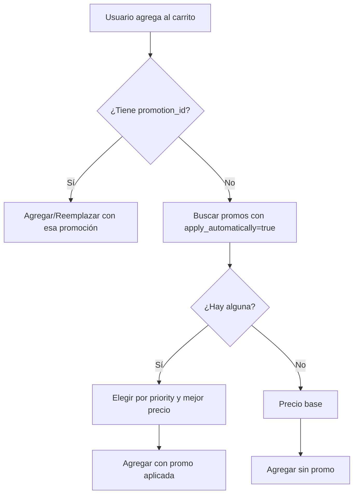
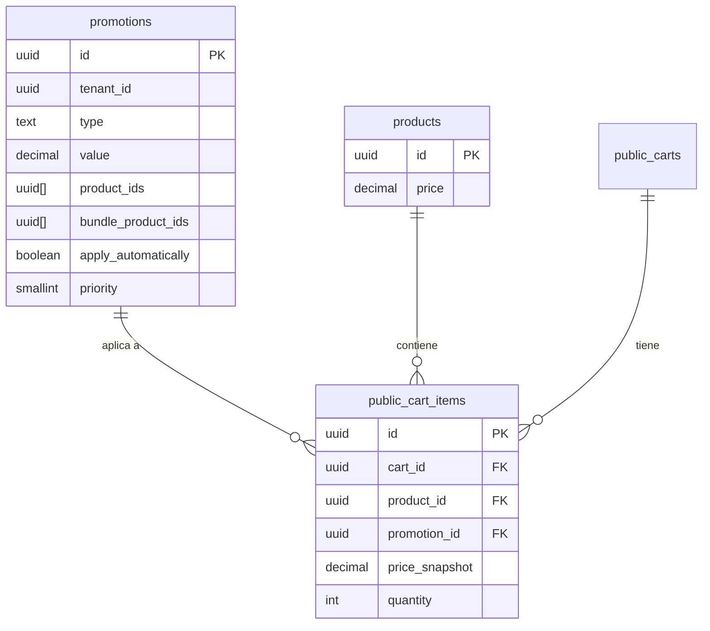

# Promociones: Casos de Uso, Comportamiento y Base de Datos

Especificación para cuando un producto puede tener descuento individual Y formar parte de una promoción grupal.

---

## 1. Tipos de Promoción Actuales

| Tipo | Descripción | Productos | Ejemplo |
|------|-------------|-----------|---------|
| `percentage` | Descuento % sobre precio base | `product_ids` | 20% en Producto A |
| `fixed_amount` | Descuento en monto fijo | `product_ids` | $50 off en Producto A |
| `fixed_price` | Precio fijo por unidad | `product_ids` | Producto A a $99 |
| `bundle_price` | Pack: varios productos por precio total | `bundle_product_ids` + `quantity` | 3 productos por $199 |
| `event_badge` | Solo etiqueta visual (sin descuento) | opcional | "Nuevo", "Edición limitada" |

---

## 2. Problema a Resolver

**Escenario real:**
- Producto A esta semana: 20% descuento (Promo "Semana especial")
- Producto A también está en "Pack Regalo" con B y C: 3 por $299 (bundle_price)
- El cliente puede entrar por: catálogo, página de Promo Semana, o página de Pack Regalo

**Preguntas:**
1. ¿Qué pasa si agrega A desde catálogo? ¿Precio normal o precio de Semana especial?
2. ¿Qué pasa si ya tiene A con Semana y luego agrega Pack Regalo completo?
3. ¿Un producto puede "ganar" la mejor promoción automáticamente?

---

## 3. Casos de Uso Detallados

### UC-P01: Cliente agrega producto desde catálogo (sin elegir promoción)

| Paso | Acción | Sistema |
|------|--------|---------|
| 1 | Cliente ve Producto A en /productos | Muestra precio base |
| 2 | Cliente hace clic "Agregar al carrito" | POST public-cart con product_id (sin promotion_id) |
| 3 | Sistema valida | ¿A tiene alguna promoción activa aplicable automática? |

**Criterio de negocio a definir:**

| Opción | Comportamiento | Pros | Contras |
|--------|----------------|------|---------|
| A | Siempre precio base | Simple, predecible | Pierde ventas con descuentos automáticos |
| B | Aplicar la promoción de mejor beneficio si existe | Mejor para el cliente | Necesita regla: ¿cuál es "mejor"? |
| C | Solo aplicar promociones "automáticas" (nuevo flag) | Control granular | Más complejidad en BD |

---

### UC-P02: Cliente agrega desde página de promoción individual (ej. Semana especial 20%)

| Paso | Acción | Sistema |
|------|--------|---------|
| 1 | Cliente entra a /promociones/semana-especial | Ve productos con 20% off |
| 2 | Cliente hace clic "Agregar promoción al carrito" | POST public-cart con promotion_id |
| 3 | Sistema agrega todos los productos de la promoción con precio calculado | Upsert por product_id |

**Conflicto:** Si Producto A ya está en carrito (de catálogo o de otra promoción):
- **Actual:** Se reemplaza con la nueva promoción (última gana).
- **Propuesto:** Mantener o preguntar (ver Sección 6).

---

### UC-P03: Cliente agrega desde página de promoción tipo pack (bundle)

| Paso | Acción | Sistema |
|------|--------|---------|
| 1 | Cliente entra a /promociones/pack-regalo | Ve A, B, C = 3 por $299 |
| 2 | Cliente hace clic "Agregar promoción al carrito" | POST public-cart con promotion_id |
| 3 | Sistema agrega A, B, C con precio repartido ($299/3 c/u) | Upsert por product_id |

**Conflicto:** Si A ya está con Promo "Semana especial" (20%):
- A con 20% podría ser $80 (si base $100).
- A en pack = $99.67.
- **Actual:** Se reemplaza con pack (peor precio para A).
- **Propuesto:** Ver reglas de prioridad (Sección 6).

---

### UC-P04: Producto en múltiples promociones simultáneas

Ejemplo: A está en:
- Promo 1: 20% off (percentage)
- Promo 2: Pack con B y C (bundle_price)

**Regla clave:** Un item del carrito solo puede tener UNA promoción a la vez (por UNIQUE cart_id, product_id).

---

### UC-P05: Ver en qué promociones está un producto

| Paso | Acción | Sistema |
|------|--------|---------|
| 1 | Cliente entra a /productos/producto-a | Ve detalle del producto |
| 2 | Sistema consulta | Promociones activas donde product_ids o bundle_product_ids incluyen A |
| 3 | UI muestra | "También en: Semana especial (20%), Pack Regalo (3x$299)" con links |

**Estado actual:** No implementado. La página de producto no muestra promociones asociadas.

---

## 4. Diagramas

### 4.1 Modelo de datos actual

```
┌─────────────────┐     ┌──────────────────────┐     ┌─────────────────┐
│   promotions     │     │  public_cart_items   │     │    products     │
├─────────────────┤     ├──────────────────────┤     ├─────────────────┤
│ id              │◄────│ promotion_id (FK)   │     │ id              │
│ tenant_id       │     │ cart_id              │     │ tenant_id        │
│ name            │     │ product_id (FK) ─────┼────►│ name, price     │
│ type            │     │ quantity             │     │ ...              │
│ value           │     │ price_snapshot       │     └─────────────────┘
│ product_ids[]   │     │ UNIQUE(cart_id,     │
│ bundle_product_ │     │         product_id)  │   ← Un producto = 1 fila
│   ids[]         │     └──────────────────────┘      por carrito
│ valid_from/until│
└─────────────────┘
```

### 4.2 Flujo: Agregar al carrito (orígenes posibles)

```
                    ┌──────────────────┐
                    │   Origen agregar  │
                    └────────┬──────────┘
                             │
         ┌───────────────────┼───────────────────┐
         │                   │                   │
         ▼                   ▼                   ▼
┌────────────────┐  ┌────────────────┐  ┌────────────────┐
│ Desde catálogo │  │ Desde promo    │  │ Desde promo    │
│ /productos/A   │  │ individual     │  │ pack/bundle    │
│ (sin promo)    │  │ /promo/semana  │  │ /promo/pack   │
└───────┬────────┘  └───────┬────────┘  └───────┬────────┘
        │                  │                   │
        │ POST product_id  │ POST promotion_id │ POST promotion_id
        │                  │                   │
        └──────────────────┼───────────────────┘
                           │
                           ▼
                ┌──────────────────────┐
                │  API public-cart     │
                │  ¿product_id solo?   │
                │  ¿o promotion_id?   │
                └──────────┬───────────┘
                           │
          ┌────────────────┼────────────────┐
          │                │                │
          ▼                ▼                ▼
   ┌────────────┐  ┌───────────────┐  ┌──────────────┐
   │ Sin promo  │  │ Con promo     │  │ Producto ya   │
   │ precio     │  │ calcula       │  │ en carrito?   │
   │ base       │  │ precio según  │  │ UPSERT =      │
   │            │  │ tipo promo   │  │ reemplazar    │
   └────────────┘  └───────────────┘  └──────────────┘
```

### 4.3 Conflicto: producto en dos promociones

```
Caso: A está en Promo1 (20%) y en Promo2 (pack)

Carrito ANTES:
  A (promotion_id=Promo1, price_snapshot=80)

Usuario agrega "Pack Regalo" (Promo2) al carrito

Carrito DESPUÉS (comportamiento actual):
  A (promotion_id=Promo2, price_snapshot=99.67)  ← Reemplazado
  B (promotion_id=Promo2, price_snapshot=99.67)   ← Nuevo
  C (promotion_id=Promo2, price_snapshot=99.67)  ← Nuevo

El cliente paga más por A que antes (80 → 99.67).
```

### 4.4 Relación producto ↔ promociones (N:N)

```
        products                    promotions
     ┌──────────┐                ┌──────────────┐
     │ A        │◄─── product_ids─│ Promo Semana │
     │ B        │                │ (percentage) │
     │ C        │                └──────────────┘
     └────┬─────┘                       │
          │                             │
          │    bundle_product_ids       │
          └─────────────────────────────┤
                                        │
                               ┌────────┴────────┐
                               │   Pack Regalo   │
                               │ (bundle_price)  │
                               └─────────────────┘

A está en 2 promociones. Al agregar al carrito, solo una puede aplicarse.
```

---

## 5. Cambios de Base de Datos Propuestos

### 5.1 Estado actual (ya implementado)

```sql
-- promotions
product_ids uuid[]           -- productos con descuento individual
bundle_product_ids uuid[]    -- productos del pack (bundle)
quantity integer             -- para bundle: "quantity por $value"

-- public_cart_items
promotion_id uuid            -- qué promoción se aplicó a este item
UNIQUE(cart_id, product_id)  -- 1 producto = 1 fila por carrito
```

### 5.2 Opciones para prioridad / comportamiento

**Opción A: Sin cambios en BD (solo reglas en aplicación)**

- Mantener estructura actual.
- Implementar lógica en API: al agregar producto sin promo, buscar promociones activas donde esté el producto y aplicar la de "mejor beneficio".
- Definir orden de prioridad en código (ej. bundle > percentage > fixed_price > base).

**Opción B: Agregar `priority` en promotions**

```sql
ALTER TABLE promotions ADD COLUMN IF NOT EXISTS priority smallint DEFAULT 100;
-- Menor número = mayor prioridad. Ej: 10=bundle, 20=percentage, 50=base
```

Permite que el negocio configure qué promoción gana cuando hay conflicto.

**Opción C: Agregar `apply_automatically` en promotions**

```sql
ALTER TABLE promotions ADD COLUMN IF NOT EXISTS apply_automatically boolean DEFAULT false;
```

- Si `true`: al agregar producto desde catálogo, el sistema puede aplicar esta promo si el producto está en ella.
- Si `false`: solo se aplica cuando el usuario agrega explícitamente desde la página de la promoción.

**Opción D: Tabla de prioridad por producto (más flexible)**

```sql
CREATE TABLE promotion_product_priority (
  id uuid PRIMARY KEY DEFAULT uuid_generate_v4(),
  promotion_id uuid NOT NULL REFERENCES promotions(id) ON DELETE CASCADE,
  product_id uuid NOT NULL REFERENCES products(id) ON DELETE CASCADE,
  priority smallint NOT NULL DEFAULT 100,
  UNIQUE(promotion_id, product_id)
);
```

Sobreingeniería para la mayoría de casos. Solo si se necesita prioridad distinta por producto dentro de una misma promo.

### 5.3 Recomendación

| Cambio | Recomendación | Motivo |
|--------|---------------|--------|
| `priority` en promotions | Opcional | Útil si hay muchas promos solapadas |
| `apply_automatically` | Recomendado | Resuelve "agregar desde catálogo con descuento" sin complejidad |
| Tabla intermedia | No | Mantener simple |

### 5.4 Migración mínima sugerida

```sql
-- docs/promociones: add apply_automatically and priority
ALTER TABLE public.promotions
  ADD COLUMN IF NOT EXISTS apply_automatically boolean NOT NULL DEFAULT false,
  ADD COLUMN IF NOT EXISTS priority smallint NOT NULL DEFAULT 100;

COMMENT ON COLUMN public.promotions.apply_automatically IS 
  'Si true, al agregar producto desde catálogo se aplica esta promo si el producto está en ella';
COMMENT ON COLUMN public.promotions.priority IS 
  'Menor = mayor prioridad cuando varias promos aplican al mismo producto (default 100)';
```

---

## 6. Reglas de Comportamiento Propuestas

### 6.1 Al agregar producto desde catálogo (sin promotion_id)

1. Buscar promociones activas donde el producto esté en `product_ids` o `bundle_product_ids`.
2. Filtrar solo las con `apply_automatically = true`.
3. De las que apliquen, elegir la de menor `priority` (mayor prioridad).
4. Si hay empate, elegir la de mejor beneficio para el cliente (menor precio final).
5. Si no hay ninguna, precio base.

### 6.2 Al agregar desde página de promoción (con promotion_id)

**Comportamiento actual (reemplazar):** Mantener. Es explícito: el usuario eligió esa promoción.

**Mejora opcional:** Si algún producto de la promoción ya está en el carrito con otra promo de mayor prioridad o mejor precio, mostrar aviso: "El producto X ya tiene un mejor precio con [Promo Y]. ¿Reemplazar con [esta promoción]?"

### 6.3 Resumen de decisiones

| Escenario | Decisión |
|-----------|----------|
| Agregar desde catálogo | Aplicar promo automática si existe y apply_automatically=true; sino precio base |
| Agregar desde promo A, producto ya con promo B | Reemplazar con A (usuario eligió explícitamente) |
| Producto en 2+ promos, ambas automáticas | Usar priority; si empate, mejor precio |
| Bundle: agregar pack completo | Siempre upsert; productos que ya estaban se reemplazan con precio del pack |

---

## 7. Resumen de Tareas

| # | Tarea | BD | API | UI |
|---|-------|----|-----|-----|
| 1 | Migración: apply_automatically, priority | ✓ | - | - |
| 2 | Dashboard: checkbox "Aplicar automáticamente" al crear/editar promo | - | - | ✓ |
| 3 | Dashboard: campo prioridad (opcional) | - | - | ✓ |
| 4 | API public-cart: al agregar sin promotion_id, buscar y aplicar promo automática | - | ✓ | - |
| 5 | Página producto: listar promociones donde está el producto | - | ✓ | ✓ |
| 6 | Carrito: mostrar nombre de la promoción aplicada (no solo badge) | - | ✓ | ✓ |
| 7 | (Opcional) Modal al agregar promo: "X ya en carrito con mejor precio" | - | ✓ | ✓ |

---

## 8. Diagrama ER Actualizado (con columnas propuestas)

```
┌─────────────────────────────────────────────────────────────┐
│                      promotions                             │
├─────────────────────────────────────────────────────────────┤
│ id, tenant_id, name, slug, type, value, min_amount           │
│ product_ids uuid[], bundle_product_ids uuid[], quantity      │
│ valid_from, valid_until                                       │
│ apply_automatically boolean DEFAULT false   ← NUEVO          │
│ priority smallint DEFAULT 100                 ← NUEVO         │
└─────────────────────────────────────────────────────────────┘
```

---

## 9. Diagramas Mermaid

### 9.1 Diagrama de flujo: decisión al agregar al carrito



### 9.2 Diagrama de entidad-relación



---

*Documento creado para especificar el comportamiento de promociones solapadas. Revisar y aprobar antes de implementar.*
